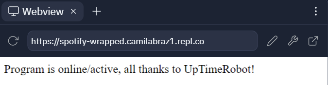

# spotify-wrapped-generator

<a href = "https://www.canva.com/design/DAFZFXaZ1ks/tQPI0eInOTYCWX8yLDzYHQ/edit"> Canvas cover art</a>

## Requirements

1. Spotify Client Id and Spotify Client Secret

Both are available on <a href = "https://developer.spotify.com/dashboard/"> Spotify Developer Dashboard </a>, after you create an app.
Make shure to add your user on `USER SETTINGS` and add  `http://localhost` and `http://localhost/callbacks` on `Redirect URIs` available on `EDIT SETTINGS` both configurations are inside the app page.

Set on .env file, along with your spotify username

2. Cache file

The first time you run the code, you will be asked to go to an URL, log on spotify and paste on the terminal the redirected URL (localhost something). This will create a cache file for your user on the folder.

## How to run
1. `git clone git@github.com:camilasbraz/spotify-wrapped-generator.git`
2. `python -m venv venv`
3. `venv/Scripts/activate`
4. `pip install -r requirements.txt`
5. `set up the .env`
6. `python main.py`

## Host on Replit and UpTimeRobot

1. Create a replt account: [Here](https://replit.com/)
2. New python repl
3. Upload the files (except .env)
4. Use the Secret tab to add the .env vars
5. Run the code!!!
6. A webdriver tab will open on the left side of the page. Copy the url

  

7. Create an UpTimeRobot account  [Here](https://uptimerobot.com)
8. Click on  `Add New Monitor` and set the following configs:

`Monitor type: http`

`Name: anything you want`

`URL: the URL copied in step 6`

`Interval: 5 minutes`

`Timeout: 30 seconds`

The remaining configurations can be set to default, just scroll down and click on `Create the Monitor`

9. Rerun the cond on repl

